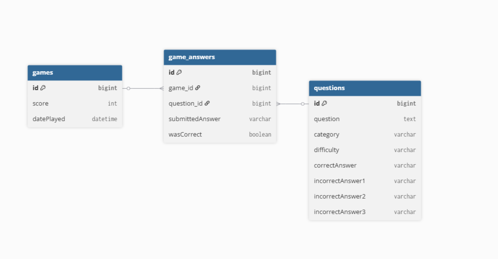

# Trivia

## Overview

This repository contains a full-stack trivia application:

- **Backend**: Java 21 + Spring Boot API for saving game sessions and retry data.
- **Frontend**: React + TypeScript app for playing trivia and retrying previously incorrect answers.

Project locations:

- Backend: root folder
- Frontend: `frontend` folder

Quick start docs:

- Backend + full project entrypoint: this README
- Frontend details: [`frontend/README.md`](frontend/README.md)

## Setup

### Backend requirements

- Java 21
- Maven (or use the included Maven wrapper `./mvnw`)
- MySQL running locally

### Backend configuration

Main config file: `src/main/resources/application.properties`

It expects:

- `spring.datasource.url` (default points to `jdbc:mysql://localhost:3306/trivia`)
- `spring.datasource.username` (default `root`)
- `spring.datasource.password`

The project imports optional local overrides from `application-secrets.properties`:

```properties
spring.config.import=optional:file:application-secrets.properties
```

You can keep credentials in that local file (not committed) or provide environment-backed values.

### Frontend requirements

- Node.js + npm

See full frontend setup in [`frontend/README.md`](frontend/README.md).

## Run

### Run backend API

From root:

```bash
sh ./mvnw spring-boot:run
```

The backend serves at `http://localhost:8080`.

### Run frontend app

From `frontend`:

```bash
npm install
npm run dev
```

The frontend dev server runs at `http://localhost:5173`.

## Build/Test/Lint

### Backend

From root:

    ./mvnw clean package
    ./mvnw test

### Frontend

From `frontend/`:

```bash
npm run build
npm run lint
```

## API/Architecture

### High-level architecture

- Frontend fetches quiz content from OpenTDB and sends game outcomes to the backend API.
- Backend persists games, questions, and game answers in MySQL.
- Retry mode fetches previously incorrect, non-archived answers and can archive corrected retries.

### Backend API overview

Base URL: `http://localhost:8080`

- `POST /games`  
  Save a completed game payload.
- `GET /games`  
  List saved games.
- `POST /questions`  
  Save a list of questions.
- `GET /questions`  
  List questions.
- `GET /game-answers`  
  Fetch retry candidates with query params:
  - `archived` (required, boolean)
  - `wasCorrect` (required, boolean)
  - `quantity` (required, int)
  - `difficulty` (optional, string)
- `PATCH /game-answers/{id}`  
  Update retry answer archive state.
- `GET /game-answers/retry-counts`  
  Get available retry counts by difficulty.

### CORS/local development note

Backend CORS currently allows `http://localhost:5173`, which matches the frontend dev server.

### Data model



- One `Game` has many `GameAnswer` records.
- Each `GameAnswer` links to one `Game` and one `Question`.
- One `Question` can appear in many `GameAnswer` records.

## Troubleshooting

- **Backend fails to start**: check MySQL is running and the DB credentials are valid.
- **Frontend cannot load/save retry data**: ensure backend is running on `http://localhost:8080`.
- **CORS errors in browser**: verify frontend is served from `http://localhost:5173`.

## Project history

This project started as a coursework MVP (trivia play + score + retry mode with backend persistence). Legacy MVP checklist content was removed from this README to keep it focused on current usage and maintenance.

## References

- [nology project brief](https://github.com/nology-tech/aus-post-course-guide/tree/main/projects/trivia-api)
- [Group Trello Board](https://trello.com/b/14XGoYKh/trivia-full-stack-project-fred-carrie)
- [Figma Board](https://www.figma.com/board/p0I0y8Sr4brnA6b1FiPCDy/trivia?node-id=0-1&t=a3gPBNrj4if6PYC4-1)
- [Figma prototype](https://www.figma.com/proto/zPos2p8aVm7ntacLZgqYGO/trivia-mockups?page-id=0%3A1&node-id=55-1145&viewport=-762%2C-28%2C0.13&t=5Jyom8thV8RuHazm-1&scaling=scale-down&content-scaling=fixed&starting-point-node-id=55%3A1145&show-proto-sidebar=1)
