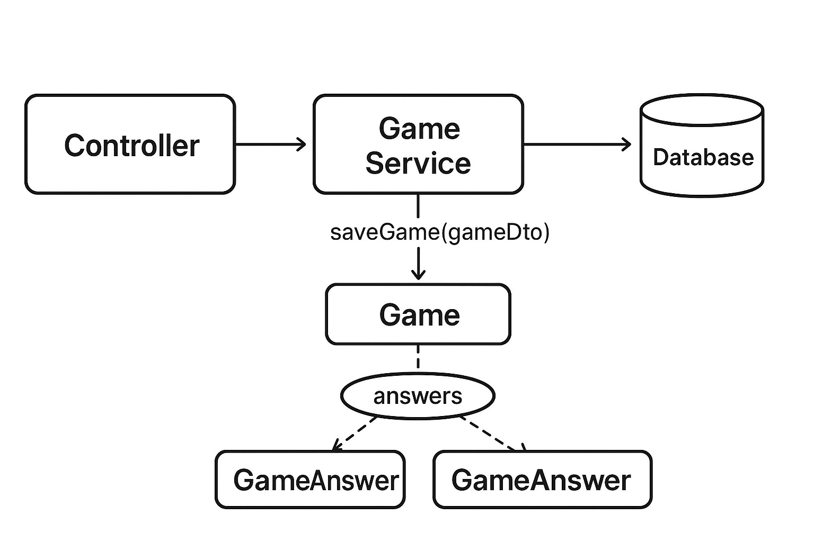

# Trivia Quiz Progress API

## Introduction

This project is an extension of the [Trivia UI](https://github.com/nology-tech/aus-post-course-guide/blob/main/projects/trivia/README.md "‌") Your task is to create an API that will allow users to keep track of the quiz games they played.

## MVP

- [x] When the user completes a quiz, it gets submitted to the API that keeps track of all game details:
  - [x] Score
  - [x] Date played
  - [x] Questions answered
  - [x] Submitted answer for each question
  - [x] Correct answer for each question
  - [x] If a question was failed or not
        ~~- [ ] One of the API endpoints should allow filtering questions by failed~~
- [ ] On the frontend, the user should be able to view questions that they answered wrong
- [ ] They should be able to attempt those questions again
- [ ] If they answer the question correctly, it should get archived in the database

## Technologies

- Java
- Spring Boot
- Hibernate
- JPA

## Features (+ Data Flow)

### Save Games: Saving a Game on Completion

- When a user finishes a quiz, it's info (score, questions, answers) gets saved in a database in backend.

Data flow: Frontend (GameResult) -> Backend (DB)

> In other words:
> GameResultDto → (1) saveGame → (2) saveQuestions → (3) saveAnswers

### Retry Questions: Creating a new Game from previous game questions

Data flow: Backend (questions) -> Frontend (GameResult) -> Backend (DB)

- When user wants to reattempt incorrectly answer questions from their past games, we have to fetch these from our DB and send to frontend when creating a new game.

- Query params can be use for custom filtering eg. no. of q, type/category etc.

## Spring Architecture

### Game Service

GameService handles BOTH saving Game and Game Answers (via cascading).

The gameService needs to (in order!):

1. Save the Game record first (because GameAnswer needs its FK).
2. Ensure Questions exist (so GameAnswer can reference them).
3. Save each GameAnswer linked to both Game + Question.

### Question Service

Questions are handled by a separate QuestionService.

## Database Design

Our Database requirements were:

1. A Game holds a list of GameAnswers.
2. A GameAnswer references both a Game and a Question.
3. A Question can be linked to multiple GameAnswers.

From the ERD diagram above:

> games ↔ game_answers: One-to-Many

- One Game has many GameAnswers.
- Each GameAnswer belongs to one Game.

> questions ↔ game_answers: One-to-Many

- One Question can appear in many GameAnswers.
- Each GameAnswer links to exactly one Question.

## Project Links

- [nology project brief](https://github.com/nology-tech/aus-post-course-guide/tree/main/projects/trivia-api)
- [Group Trello Board](https://trello.com/b/14XGoYKh/trivia-full-stack-project-fred-carrie)
- [Figma Board](https://www.figma.com/board/p0I0y8Sr4brnA6b1FiPCDy/trivia?node-id=0-1&t=a3gPBNrj4if6PYC4-1)

<!-- ## Contact

This was a joint project between two developers, you can contact them here: -->

- add linked accounts here
